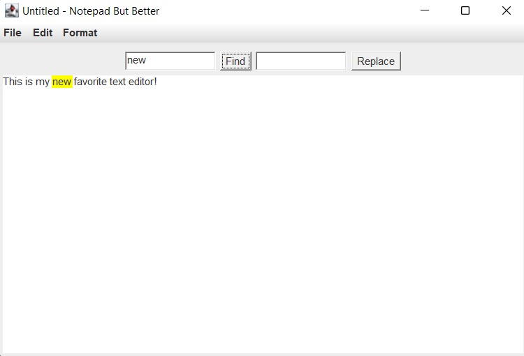

# Demo

# Introduction

A simple, lightweight text editor is a programmer's best friend. There are many things to
take into consideration when designing such a program. The basic functionality of the text editor must
allow us to be able to open a new, blank document, save a new text file or update an already saved file, or
to open a file from the device. This is my implementation, in Java, of a notepad that checks the above mentioned boxes.

## To launch in IntelliJ

- Import project
- Build
- Run
  - To run, create a new configuration
  - Main class: `notepad.NotepadGUIReal`

P.S. Originally built in Eclipse
